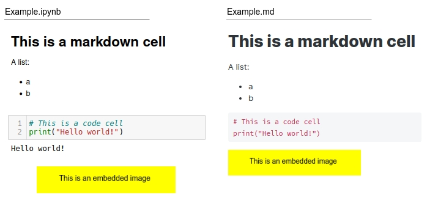

# JupyterNotebookToMarkdown
Convert Jupyter Notebooks to Markdown, copying attached images in a folder. 

## Why
Nbconvert does not correctly copy images attached to a notebook cell (with ctrl-v). \
This simple script saves the attached images in a folder and attaches them in the markdown file.

## Installation

```
git clone https://github.com/AndreaMnzt/JupyterNotebookToMarkdown.git
chmod +x notebook2markdown.py 
```
## Usage
You must copy your jupyter notebook in the `JupyterNotebookToMarkdown/` folder and run:

```
./notebook2markdown.py filename.ipynb
```

## Convertion example 


